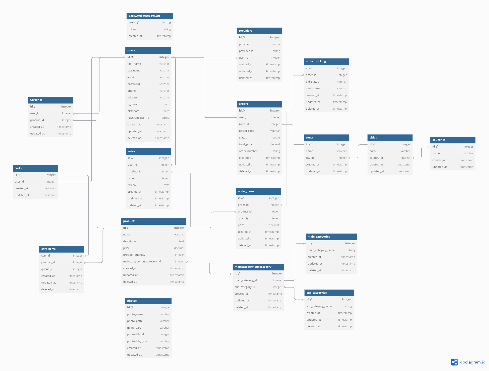

# E_Commerce Project

## Description

This E-Commerce platform is a robust, multi-role system designed to cater to the needs of Admins, Sales Managers, Store Managers, and Customers. Each user role is equipped with tailored functionalities, ensuring a seamless experience while managing products, orders, categories, reports, and user accounts.

The platform offers comprehensive e-commerce features, including:

-   **Product and Category Management** for organizing inventory efficiently.
-   **Order Tracking and Management** to ensure timely delivery and operational transparency.
-   **User Account Management** with role-based permissions for secure and streamlined access.
-   **Advanced Reporting Tools**, providing actionable insights like best-selling products, order trends, and inventory analysis.

Built for scalability and ease of use, this system supports role-specific workflows, enabling administrators and managers to make data-driven decisions while delivering a user-friendly shopping experience to customers.

## Features

### User Role & Permissions

# ======== Admin ========

-   **Cart Management**: Admin can view the cart and manage it.
-   **CRUD Main Categories**: Admin can create, read, update, and delete main product categories.
-   **CRUD Sub Categories**: Admin can manage sub-categories under each main category.
-   **CRUD Products**: Admin can manage products by adding, updating, and deleting them.
-   **Order Management**: Admin can view all orders, update the status, and delete orders.
-   **Product & Category Photo Management**: Admin can upload or delete photos for products and categories.
-   **User Management**: Admin can create, read, update, and delete user accounts.
-   **Reporting**: Admin has access to all the following reports:
    -   Orders Late to Deliver
    -   Products Remaining in Carts
    -   Products Low on Stock
    -   Best-Selling Products
    -   Best-Selling Categories
    -   Products Never Been Sold
    -   Countries with Highest Orders

# ======== Sales Manager ========

-   **Order Management**: Sales Manager can view specific orders.
-   **Order Tracking**: Sales Manager can track the status of orders to ensure timely delivery.
-   **Reporting**: Sales Manager has access to the following reports:
    -   Orders Late to Deliver
    -   Best-Selling Products
    -   Best-Selling Categories
    -   Countries with Highest Orders

# ======== Store Manager ======

-   **CRUD Main Categories**: Store Manager can manage main product categories.
-   **Order Management**: Store Manager can update specific orders and track their status.
-   **Product & Category Photo Management**: Store Manager can upload photos for products, main categories, or sub-categories.
-   **CRUD Sub Categories**: Store Manager can manage sub-categories.
-   **Reporting**: Store Manager has access to the following reports:
    -   Products Remaining in Carts
    -   Products Low on Stock
    -   Best-Selling Products
    -   Best-Selling Categories
    -   Products Never Been Sold
    -   Countries with Highest Orders

# ======== Customer ========

-   **Favorite Products**: Customers can delete their favorite products from the system.
-   **Order Information**: Customers can view orders related to their accounts.
-   **Profile Management**: Customers can upload or delete their avatar photo.
-   **Product Rating**: Customers can update, delete their product ratings, and leave reviews.
-   **Account Management**: Customers can update their account information or delete their account entirely.

## Technologies Used:

-   Laravel 10
-   PHP
-   MySQL
-   XAMPP
-   Composer
-   Postman Collection: Contains all API requests for easy testing and interaction with the API.

## ERD



## Installation

### Prerequisites

Ensure you have the following installed on your machine:

-   **XAMPP**: For running MySQL and Apache servers locally.
-   **Composer**: For PHP dependency management.
-   **PHP**: Required for running Laravel (mark: version 8.2 or less).
-   **MySQL**: Database for the project.
-   **Postman**: Required for testing the requests.

### Steps to Run the Project

1.  **Clone the Repository**

    ```bash
    git clone https://github.com/TukaHeba/E-Commerce-Project.git
    ```

2.  **Navigate to the Project Directory**
    ```bash
    cd E-Commerce-Project
    ```
3.  **Install Dependencies**
    ```bash
    composer install
    ```
4.  **Create Environment File**
    ```
    cp .env.example .env
    Update the .env file with your database configuration (MySQL credentials, database name, etc.).
    ```
5.  **Generate Application Key**
    ```
    Generate Application Key
    ```
6.  **Run Migrations**
    ```
    php artisan migrate
    ```
7.  **Seed The Database**
    ```
    php artisan db:seed
    ```
8.  **Run the application**
    ```
    php artisan server
    ```
9.  **Run the Cron Job**

    To automate tasks like sending email notifications or running background processes, set up a cron job.

    1. Add your email address to the database either by using a seeder or manually. This will ensure that you receive notifications.
    2. Start the Queue Worker
        ```
        php artisan queue:work
        ```
    3. Start the Schedule Worker
        ```
        php artisan schedule:work
        ```

### Postman Collection:

You can access the Postman collection for this project by following this [link](https://documenter.getpostman.com/view/34424205/2sAYBYgqz4). The collection includes all the necessary API requests for testing the application.
<!-- https://documenter.getpostman.com/view/34424205/2sAYBYgqz4 -->
